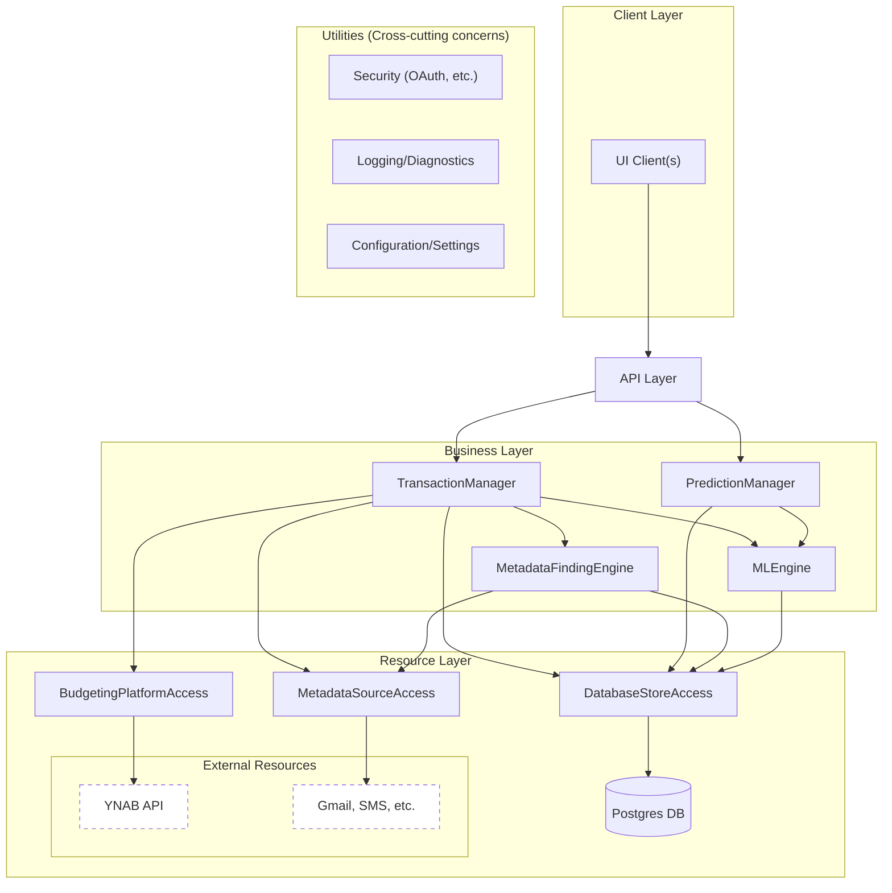

```mermaid
flowchart TD
  %% Layers
  %% Client Layer
  subgraph ClientLayer["Client Layer"]
    UIClient["UI Client(s)"]
  end

  %% Business Layer
  subgraph BusinessLayer["Business Layer"]
    direction TB
    %% Managers (top row)
    TransactionManager["TransactionManager"]
    PredictionManager["PredictionManager"]
    %% Engines (bottom row)
    MetadataFindingEngine["MetadataFindingEngine"]
    MLEngine["MLEngine"]
  end

  %% API Layer
  APILayer["API Layer"]

  %% Resource Layer
  subgraph ResourceLayer["Resource Layer"]
    direction TB
    %% ResourceAccess (top row)
    BudgetingPlatformAccess["BudgetingPlatformAccess"]
    MetadataSourceAccess["MetadataSourceAccess"]
    DatabaseStoreAccess["DatabaseStoreAccess"]
    %% Resources (bottom row)
    PostgresDB[("Postgres DB")]
    %% External Resources (inside system boundary, dotted)
    subgraph ExternalResources["External Resources"]
      direction TB
      extYNABAPI["YNAB API"]
      extMetadataSources["Gmail, SMS, etc."]
    end
  end

  %% Utilities Bar
  subgraph UtilitiesBar["Utilities (Cross-cutting concerns)"]
      Security["Security (OAuth, etc.)"]
      Logging["Logging/Diagnostics"]
      Config["Configuration/Settings"]
  end

  %% Connections
  UIClient --> APILayer
  APILayer --> TransactionManager
  APILayer --> PredictionManager

  TransactionManager --> MetadataFindingEngine
  TransactionManager --> MLEngine
  TransactionManager --> BudgetingPlatformAccess
  TransactionManager --> MetadataSourceAccess
  TransactionManager --> DatabaseStoreAccess

  PredictionManager --> MLEngine
  PredictionManager --> DatabaseStoreAccess

  MetadataFindingEngine --> MetadataSourceAccess
  MetadataFindingEngine --> DatabaseStoreAccess

  MLEngine --> DatabaseStoreAccess

  BudgetingPlatformAccess --> extYNABAPI
  MetadataSourceAccess --> extMetadataSources
  DatabaseStoreAccess --> PostgresDB

  %% Styling for external resources
  classDef extResource fill:#fff,stroke-dasharray: 5 5;
  class extYNABAPI,extMetadataSources extResource;
```