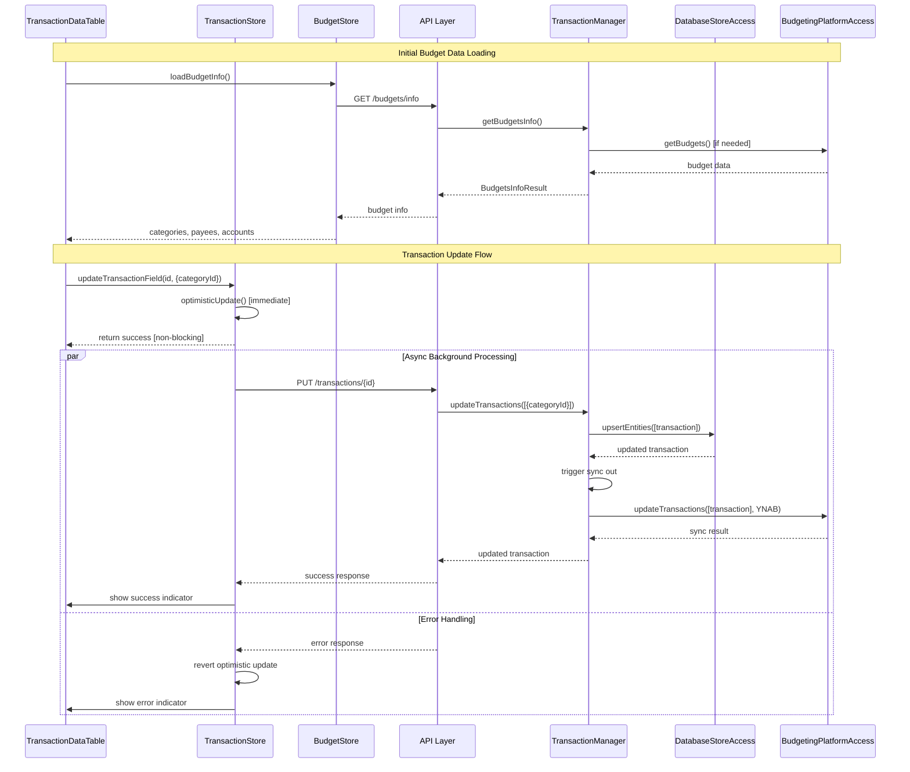

# Design Document

## Overview

This design implements inline editing functionality for the TransactionDataTable component, allowing users to edit memo, category, and approval fields directly within the table. The solution follows The Method architecture principles, using the TransactionManager for orchestration and reusing existing sync-out functionality for YNAB synchronization.

## Architecture

### Component Architecture

The inline editing functionality will be implemented using a layered approach:

1. **UI Layer**: Enhanced TransactionDataTable with editable cells and budget data caching
2. **Store Layer**: Transaction store with optimistic updates, error handling, and budget store for categories/payees/accounts
3. **API Layer**: Transaction update endpoints and new budget info endpoints
4. **Business Layer**: TransactionManager orchestration with sync-out integration and getBudgetsInfo implementation

### Architectural Improvements

This design addresses several architectural violations:

1. **Proper Layer Separation**: API layer will call TransactionManager.getBudgetsInfo instead of directly accessing BudgetingPlatformAccess
2. **Data Consistency**: Frontend will maintain complete category/payee/account lists instead of deriving from transaction data
3. **ID-based Operations**: Category updates will use category IDs instead of names
4. **Elimination of Enrichment**: Remove _enrichTransactionsWithNames in favor of frontend ID-to-name mapping

### Service Flow



## Components and Interfaces

### 1. Enhanced TransactionDataTable Component

**File**: `frontend/src/lib/components/TransactionDataTableDemo.svelte`

**Key Changes**:
- Replace static `createRawSnippet` cells with interactive Svelte components
- Add editable cell components for memo, category, and approval fields
- Implement row-level focus management for save triggers
- Add loading states and error handling

**New Cell Components**:

#### EditableTextCell
```svelte
<script>
  import { tick } from 'svelte';
  
  let { 
    value = $bindable(), 
    onSave, 
    saveStatus = null, 
    saveError = null,
    transaction 
  } = $props();
  
  let editing = $state(false);
  let inputValue = $state(value);
  let inputRef = $state(null);

  function startEdit() {
    editing = true;
    inputValue = value;
    tick().then(() => inputRef?.focus());
  }

  function saveEdit() {
    if (inputValue !== value) {
      // Non-blocking save - returns immediately
      onSave(inputValue);
    }
    editing = false;
  }

  // Visual feedback based on save status
  $: cellClass = `
    ${editing ? 'border-blue-500 bg-blue-50' : ''}
    ${saveStatus === 'success' ? 'border-green-500 bg-green-50' : ''}
    ${saveStatus === 'error' ? 'border-red-500 bg-red-50' : ''}
  `;
</script>

<div class="relative">
  {#if editing}
    <input
      bind:this={inputRef}
      bind:value={inputValue}
      class="w-full px-2 py-1 border rounded {cellClass}"
      onblur={saveEdit}
      onkeydown={(e) => e.key === 'Enter' && saveEdit()}
    />
  {:else}
    <div 
      class="px-2 py-1 cursor-pointer hover:bg-gray-50 {cellClass}"
      onclick={startEdit}
    >
      {value || 'Click to edit'}
    </div>
  {/if}
  
  <!-- Status indicators -->
  {#if saveStatus === 'success'}
    <div class="absolute -top-1 -right-1 w-2 h-2 bg-green-500 rounded-full"></div>
  {:else if saveStatus === 'error'}
    <div class="absolute -top-1 -right-1 w-2 h-2 bg-red-500 rounded-full" title={saveError}></div>
  {/if}
</div>
```

#### EditableCategoryCell
```svelte
<script>
  import { ComboBox } from "$lib/components/ui/combobox";
  import { budgetStore } from "$lib/stores/budget";
  
  let { 
    value = $bindable(), // category ID
    onSave, 
    loading = false,
    transaction 
  } = $props();
  
  let editing = $state(false);
  
  // Get category name from ID using budget store
  $: categoryName = value 
    ? $budgetStore.categories?.find(c => c.id === value)?.name 
    : "Uncategorized";
    
  // Prepare category options for ComboBox
  $: categoryOptions = $budgetStore.categories?.map(cat => ({
    value: cat.id,
    label: cat.name
  })) || [];

  function handleCategorySelect(categoryId) {
    onSave({ categoryId }); // Send ID, not name
    editing = false;
  }
</script>

<div class="relative">
  {#if editing}
    <ComboBox
      options={categoryOptions}
      value={value}
      onSelect={handleCategorySelect}
      placeholder="Select category..."
      searchable={true}
    />
  {:else}
    <div 
      class="px-2 py-1 cursor-pointer hover:bg-gray-50"
      onclick={() => editing = true}
    >
      {categoryName}
    </div>
  {/if}
</div>
```

#### EditableApprovalCell
```svelte
<script>
  import { ComboBox } from "$lib/components/ui/combobox";
  let { value = $bindable(), onSave, loading = false } = $props();
  const approvalOptions = [
    { value: true, label: "Approved" },
    { value: false, label: "Unapproved" }
  ];
</script>
```

### 2. New Budget Store

**File**: `frontend/src/lib/stores/budget.js`

**Purpose**: Cache budget information (categories, payees, accounts) for efficient frontend lookups.

```javascript
import { writable } from 'svelte/store';
import { budgetApi } from '$lib/api/client';

function createBudgetStore() {
  const { subscribe, set, update } = writable({
    budgets: [],
    categories: [],
    payees: [],
    accounts: [],
    loading: false,
    error: null,
    lastUpdated: null
  });

  return {
    subscribe,
    
    async loadBudgetInfo(budgetIds = null, entityTypes = ['Category', 'Payee', 'Account']) {
      update(state => ({ ...state, loading: true, error: null }));
      
      try {
        const result = await budgetApi.getBudgetInfo(budgetIds, entityTypes);
        
        update(state => ({
          ...state,
          budgets: result.budgets || [],
          categories: result.categories || [],
          payees: result.payees || [],
          accounts: result.accounts || [],
          loading: false,
          lastUpdated: new Date()
        }));
        
        return result;
      } catch (error) {
        update(state => ({ 
          ...state, 
          loading: false, 
          error: error.message 
        }));
        throw error;
      }
    },
    
    getCategoryName(categoryId) {
      return get(this).categories?.find(c => c.id === categoryId)?.name || 'Uncategorized';
    },
    
    getPayeeName(payeeId) {
      return get(this).payees?.find(p => p.id === payeeId)?.name || 'Unknown';
    },
    
    getAccountName(accountId) {
      return get(this).accounts?.find(a => a.id === accountId)?.name || 'Unknown';
    }
  };
}

export const budgetStore = createBudgetStore();
```

### 3. Enhanced Transaction Store

**File**: `frontend/src/lib/stores/transactions.js`

**New Methods**:

```javascript
/**
 * Update a single transaction field with optimistic updates and non-blocking UI
 * @param {string} transactionId - Transaction ID
 * @param {Object} changes - Fields to update
 * @returns {Promise<boolean>} Success status
 */
async updateTransactionField(transactionId, changes) {
  // Optimistic update - immediate UI response
  this.updateTransaction({ id: transactionId, ...changes });
  
  // Fire-and-forget async update - don't block UI
  this._performAsyncUpdate(transactionId, changes);
  
  return true; // Return immediately for responsive UI
}

/**
 * Perform async update without blocking UI
 * @private
 */
async _performAsyncUpdate(transactionId, changes) {
  try {
    const result = await transactionApi.update(transactionId, changes);
    if (result.success !== false) {
      // Update with server response
      this.updateTransaction(result.data || result);
      // Show subtle success indicator
      this._showTransientSuccess(transactionId);
    } else {
      // Revert optimistic update and show error
      await this.refreshTransaction(transactionId);
      this._showTransientError(transactionId, result.error || 'Update failed');
    }
  } catch (error) {
    // Revert optimistic update and show error
    await this.refreshTransaction(transactionId);
    this._showTransientError(transactionId, error.message);
  }
}

/**
 * Show transient success indicator
 * @private
 */
_showTransientSuccess(transactionId) {
  // Update transaction with temporary success state
  update(state => ({
    ...state,
    transactions: state.transactions.map(t => 
      t.id === transactionId 
        ? { ...t, _saveStatus: 'success', _saveTimestamp: Date.now() }
        : t
    )
  }));
  
  // Clear success indicator after 2 seconds
  setTimeout(() => {
    update(state => ({
      ...state,
      transactions: state.transactions.map(t => 
        t.id === transactionId 
          ? { ...t, _saveStatus: null, _saveTimestamp: null }
          : t
      )
    }));
  }, 2000);
}

/**
 * Show transient error indicator
 * @private
 */
_showTransientError(transactionId, errorMessage) {
  // Update transaction with temporary error state
  update(state => ({
    ...state,
    transactions: state.transactions.map(t => 
      t.id === transactionId 
        ? { ...t, _saveStatus: 'error', _saveError: errorMessage, _saveTimestamp: Date.now() }
        : t
    )
  }));
  
  // Clear error indicator after 5 seconds
  setTimeout(() => {
    update(state => ({
      ...state,
      transactions: state.transactions.map(t => 
        t.id === transactionId 
          ? { ...t, _saveStatus: null, _saveError: null, _saveTimestamp: null }
          : t
      )
    }));
  }, 5000);
}
```

### 4. Backend Integration Points

#### TransactionManager Enhancement

**File**: `backend/business_layer/transaction_manager.py`

**New getBudgetsInfo Method**:
```python
async def getBudgetsInfo(
    self, 
    budgetIds: Optional[List[str]] = None, 
    entityTypes: Optional[List[EntityType]] = None
) -> BudgetsInfoResult:
    """
    Get budget information including categories, payees, and accounts.
    """
    try:
        # Get budgets (use default if none specified)
        if not budgetIds:
            # Get default budget
            budgets = await self.budgeting_platform_access.getBudgets(BudgetingPlatformType.YNAB)
            if not budgets:
                raise NotFoundException("No budgets found")
            budgets = [budgets[0]]  # Use first budget as default
        else:
            # Get specific budgets
            all_budgets = await self.budgeting_platform_access.getBudgets(BudgetingPlatformType.YNAB)
            budgets = [b for b in all_budgets if b.id in budgetIds]
        
        result = BudgetsInfoResult(budgets=budgets)
        
        # Get additional entities if requested
        if entityTypes:
            if EntityType.Category in entityTypes:
                result.categories = await self.budgeting_platform_access.getCategories(budgets[0].id)
            if EntityType.Payee in entityTypes:
                result.payees = await self.budgeting_platform_access.getPayees(budgets[0].id)
            if EntityType.Account in entityTypes:
                result.accounts = await self.budgeting_platform_access.getAccounts(budgets[0].id)
        
        return result
        
    except Exception as e:
        logger.error(f"Error getting budget info: {e}")
        raise InternalException(f"Failed to get budget info: {str(e)}") from e
```

**Enhanced updateTransactions Method**:
The existing `updateTransactions` method will be enhanced to automatically trigger sync-out operations after successful local updates.

```python
async def updateTransactions(
    self, transactionEdits: list[TransactionEdit]
) -> list[Transaction]:
    """
    Update multiple transactions with automatic YNAB sync.
    """
    try:
        # Existing update logic...
        updated_transactions = []
        
        for edit in transactionEdits:
            # Apply updates to database
            updated_transaction = await self._updateSingleTransaction(edit)
            updated_transactions.append(updated_transaction)
        
        # Trigger sync-out for updated transactions
        await self._syncUpdatedTransactions(updated_transactions)
        
        return updated_transactions
        
    except Exception as e:
        logger.error(f"Error updating transactions: {e}")
        raise InternalException(f"Failed to update transactions: {str(e)}") from e

async def _syncUpdatedTransactions(self, transactions: list[Transaction]) -> None:
    """
    Sync updated transactions to YNAB using existing sync-out logic.
    """
    try:
        # Use existing BudgetingPlatformAccess for sync
        platform = await self.config_service.getDefaultBudgetPlatform()
        success = await self.budgeting_platform_access.updateTransactions(
            transactions, platform
        )
        
        if not success:
            logger.warning("YNAB sync failed for updated transactions")
            # Don't fail the update - local changes are preserved
            
    except Exception as e:
        logger.warning(f"YNAB sync error (local update succeeded): {e}")
        # Don't propagate sync errors - local update was successful
```

## Data Models

### TransactionEdit Structure
Using existing Thrift-defined `TransactionEdit`:

```thrift
struct TransactionEdit {
  1: string transactionId,
  2: optional string categoryId,  // IMPORTANT: Uses ID, not name
  3: optional bool approved,
  4: optional string memo,
  5: optional list<entities.Metadata> metadata
}
```

### BudgetsInfoResult Structure
Using new Thrift-defined `BudgetsInfoResult`:

```thrift
struct BudgetsInfoResult {
  1: list<entities.Budget> budgets,
  2: optional list<entities.Account> accounts,
  3: optional list<entities.Payee> payees,
  4: optional list<entities.Category> categories
}
```

### Frontend Transaction Update Payload
```javascript
{
  id: "transaction_id",
  memo?: "updated memo",
  categoryId?: "category_id",  // IMPORTANT: ID, not name
  approved?: true|false
}
```

### API Endpoints

#### New Budget Info Endpoint
```
GET /api/budgets/info?budgetIds=[]&entityTypes=[]
Response: BudgetsInfoResult
```

#### Enhanced Transaction Update
```
PUT /api/transactions/{id}
Body: { categoryId: "uuid", memo: "text", approved: boolean }
```

## Error Handling

### Frontend Error Handling
1. **Optimistic Updates**: Apply changes immediately for responsive UX
2. **Non-blocking Operations**: All save operations return immediately, don't block UI
3. **Async Error Handling**: Handle errors asynchronously with visual feedback
4. **Error Reversion**: Revert to previous state if update fails
5. **Transient Feedback**: Show temporary success/error indicators
6. **Retry Logic**: Allow users to retry failed operations

### Backend Error Handling
1. **Local Update Priority**: Ensure local database updates succeed first
2. **Sync Failure Tolerance**: Don't fail local updates if YNAB sync fails
3. **Error Logging**: Log sync failures for monitoring
4. **Graceful Degradation**: Continue operation even if external sync fails

## Testing Strategy - FOR ALL OF THESE, DO NOT WRITE ANY TESTS. WHERE YOU SEE
## "TESTS" THEN READ IT AS "CONFIRM BY READING THE CODE PATH AND DATA FLOW"
## THAT WAY YOU CAN CATCH BUGS SOONER AND NOT WASTE TIME WRITING TESTS

### Frontend 
1. **Component Tests**: Test editable cell components in isolation
2. **Integration Tests**: Test full edit workflow with mock API
3. **Error Scenario Tests**: Test error handling and reversion
4. **Accessibility Tests**: Ensure keyboard navigation works

### Backend 
1. **Unit Tests**: Test TransactionManager update logic
2. **Integration Tests**: Test database update and sync workflows
3. **Error Handling Tests**: Test sync failure scenarios
4. **Performance Tests**: Test batch update performance

### End-to-End 
1. **Edit Workflow**: Test complete edit-to-sync workflow
3. **Concurrent Edits**: Test multiple simultaneous edits
4. **Sync Verification**: Verify YNAB synchronization

## Implementation Phases

### Phase 1: Core Inline Editing
- Implement editable cell components
- Add basic save functionality
- Implement optimistic updates in store

### Phase 2: Enhanced UX
- Add loading states and error handling
- Implement visual feedback
- Add keyboard navigation support

### Phase 3: YNAB Integration
- Enhance TransactionManager with sync-out
- Add sync status indicators
- Implement error recovery for sync failures

### Phase 4: Polish and Testing
- Add comprehensive test coverage
- Performance optimization
- Accessibility improvements