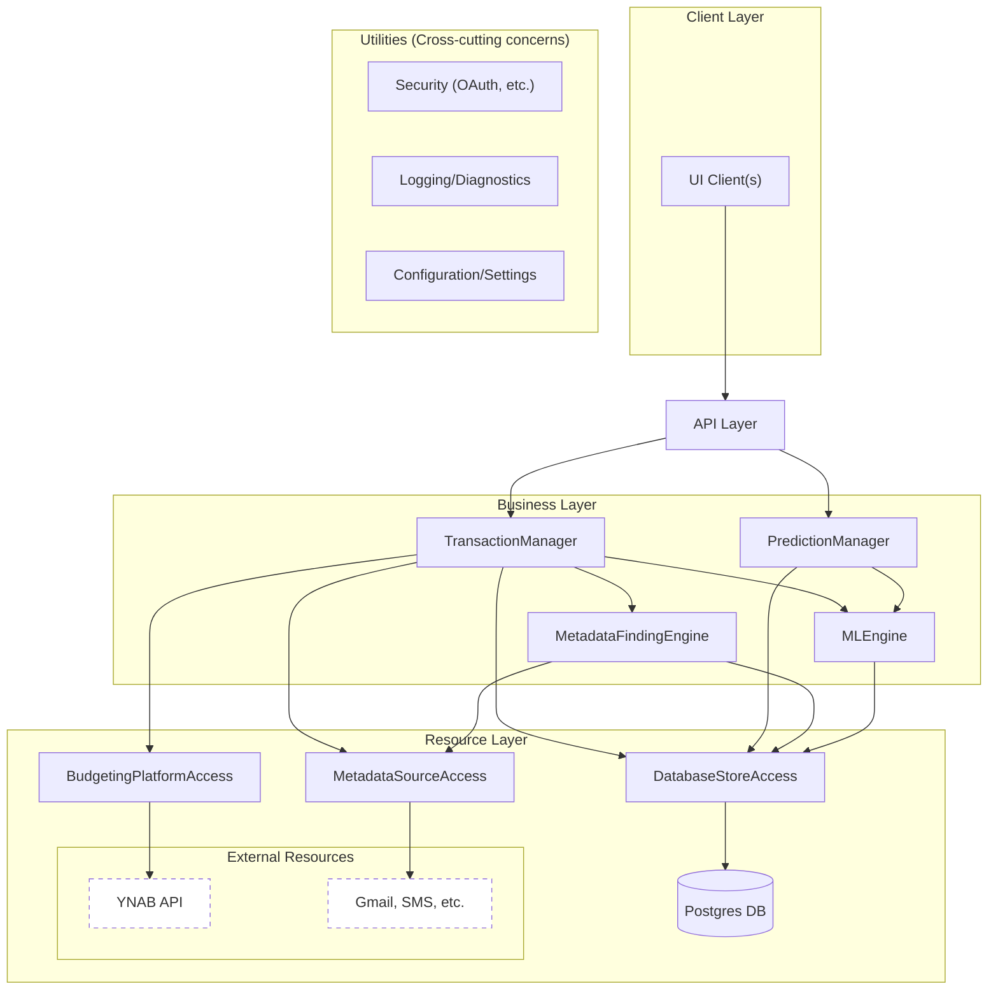

# Budget Helper Backend

The backend is built with FastAPI and follows a strict 4-layer clean architecture using volatility-based decomposition. This design ensures maintainable, testable, and extensible code that properly separates concerns.

## Architecture

The system follows architectural principles (based loosely on Juval Löwy's book Righting Software) with the following layer separation:



## Layer Architecture

### Layer 1: API Layer (`api_layer/`)
- **Purpose**: HTTP interface and request/response handling
- **Components**: FastAPI routes, middleware, authentication
- **Responsibilities**: Transform HTTP requests to business calls, handle authentication, CORS
- **Files**: `routes/` directory containing endpoint definitions

### Layer 2: Business Layer (root level)
The business layer is divided into Managers and Engines based on their role:

#### Managers (Orchestration - "What")
- **TransactionManager** (`transaction_manager.py`): Orchestrates transaction workflows
- **PredictionManager** (`prediction_manager.py`): Coordinates ML prediction workflows
- **Purpose**: Handle complete use case orchestration and workflow sequencing
- **Rules**: Call Engines and ResourceAccess services, absorb volatility in use case changes

#### Engines (Activities - "How")
- **MLEngine** (`business_layer/ml_engine.py`): Machine learning operations and model management
- **MetadataFindingEngine** (`business_layer/metadata_finding_engine.py`): Email and metadata search
- **Purpose**: Perform atomic business activities designed for reuse across Managers
- **Rules**: Encapsulate volatile business rules, no direct resource access

### Layer 3: Resource Access Layer (`resource_layer/`)
- **DatabaseStoreAccess** (`database_store_access/`): Database operations with business semantics
- **BudgetingPlatformAccess** (`budgeting_platform_access.py`): YNAB API integration
- **MetadataSourceAccess** (`metadata_source_access.py`): Gmail and other metadata sources
- **Purpose**: Expose atomic business verbs (not only CRUD), convert business operations to I/O
- **Rules**: Most reusable components, handle resource-specific concerns

### Layer 4: Resource Layer
- **PostgreSQL Database**: Primary data storage
- **External APIs**: YNAB, Gmail APIs
- **File Systems**: Model storage, temporary files

## Configuration Service

The `configs.py` module implements the centralized configuration management:

### Key Features
- **Centralized Settings**: All application configuration in one service
- **Default Values**: Comprehensive defaults in `ConfigDefaults` class
- **Dynamic Configuration**: Runtime configuration changes without restarts (except the ML Model configs which require a restart)
- **Type Safety**: Proper typing for all configuration values

### Important Configuration Keys
- `PXBLENDSC_CONFIG`: Machine learning model configuration
- `BUDGET_YNAB_AUTH_CONFIG`: YNAB authentication settings
- `EMAIL_GMAIL_AUTH_CONFIG`: Gmail OAuth configuration
- `SYSTEM_DEFAULT_MODEL_NAME`: Default ML model selection

## Thrift Entities

The system uses Apache Thrift for type definitions and service interfaces located in `.llm/core/`:

### Key Thrift Files
- `entities.thrift`: Core data types (Transaction, Budget, Category, etc.)
- `exceptions.thrift`: Standardized exception types
- `database_store_access.thrift`: Database service interface
- `ml_engine.thrift`: Machine learning service interface
- `budgeting_platform_access.thrift`: Budget platform interface

### Generating Python Types
When you modify Thrift files, regenerate Python types using:

```bash
cd .llm/core
./generate_py_entities.sh
```

This generates Python classes in `backend/thrift_gen/` which should typically be used throughout the application instead of custom data classes.

## File Structure

```
backend/
├── api_layer/                         # HTTP endpoints and FastAPI setup
│   ├── routes/                        # API route definitions
│   ├── middleware/                    # HTTP middleware
│   └── dependencies/                  # FastAPI dependencies
├── business_layer/                    # Business logic and strategies
│   ├── ml_engine.py                   # ML operations engine
│   ├── ml_strategy_base.py            # ML strategy interface
│   ├── pxblendsc_strategy.py          # PXBlendSC-RF ML implementation
│   └── metadata_finding_engine.py     # Email/metadata search
├── resource_layer/                    # Resource access layer
│   ├── database_store_access/         # Database operations
│   ├── budgeting_platform_access.py   # YNAB integration
│   └── metadata_source_access.py      # Gmail integration
├── models/                            # Pydantic models for a few internal entities
├── thrift_gen/                        # Generated Thrift types (do not edit)
├── scripts/                           # Utility scripts
├── tests/                             # Test files
├── configs.py                         # Configuration service
├── main.py                            # FastAPI application entry point
└── pyproject.toml                     # Python dependencies and configuration
```

## Layer Interaction Rules

### Allowed Interactions
- API Layer → Managers
- Managers → Engines, ResourceAccess services
- Engines → ResourceAccess services
- ResourceAccess → Resources (DB, External APIs)
- Any component → Utility services (Security, Logging, Config)

### Forbidden Interactions
- **Never call up layers**: Engine → Manager, ResourceAccess → Engine (with some exceptions)
- **Never call sideways**: Manager → Manager, Engine → Engine
- **Never bypass layers**: API → Engine directly, API → ResourceAccess directly

## Development Guidelines

### Adding New Features
1. **Determine Layer**: Is this a new use case (Manager), activity (Engine), or data operation (ResourceAccess)?
2. **Check Reusability**: Can existing components handle this through composition?
3. **Follow Contracts**: Implement exact Thrift interface contracts
4. **Use Generated Types**: Always use types from `thrift_gen/` directories

### Code Quality
```bash
# Format code
docker compose exec backend uv run ruff format .

# Check linting
docker compose exec backend uv run ruff check .

# Auto-fix issues
docker compose exec backend uv run ruff check --fix .
```

### Testing
```bash
# Run all tests
docker compose exec backend uv run python -m pytest

# Run specific test file
docker compose exec backend uv run python -m pytest tests/test_specific.py
```

### Adding Dependencies
```bash
# Add new package
docker compose exec backend uv add package-name

# Rebuild image to include new dependencies
docker compose build backend
```

## Extension Points

The architecture supports extension through well-defined interfaces:

### Budget Platforms
Implement `BudgetingPlatformAccess` interface to support platforms beyond YNAB:
- Mint, Personal Capital, or custom budget systems
- Consistent transaction and category management

### Email Providers  
Implement `MetadataSourceAccess` interface for providers beyond Gmail:
- Outlook, Yahoo, or enterprise email systems
- Consistent metadata search and attachment

### ML Strategies
Implement `MLModelStrategy` interface for new prediction approaches:
- Different algorithms (Neural Networks, Random Forest, LLMs, etc.)
- Specialized feature engineering approaches
- Custom ensemble methods

Each extension point maintains the same interface contracts, ensuring seamless integration with existing components.